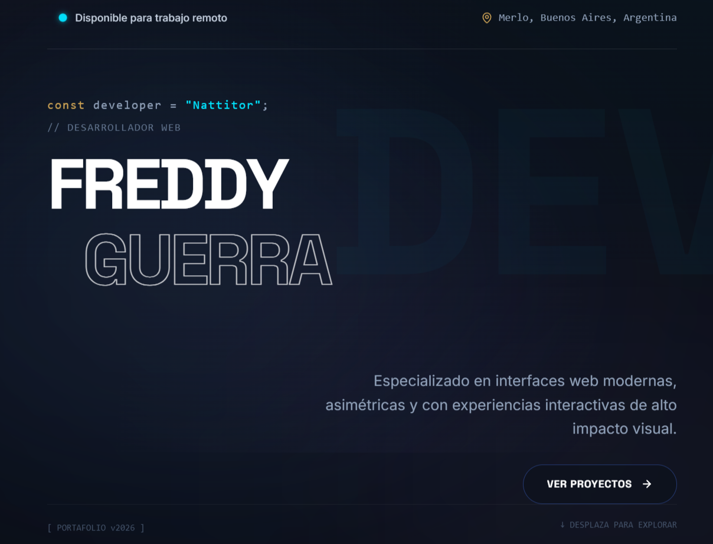

# ✦ Nattitor | Brutalist Developer Portfolio

<div align="center">
  
  
  
  
  
</div>

<br />

<div align="center">
  
  <br />
  <sub><em>Live Demo: <a href="https://portfolio-nattitors-projects.vercel.app/" target="_blank">portfolio-nattitors-projects.vercel.app</a></em></sub>
</div>

<br />

A highly optimized, brutally aesthetic portfolio built with modern web technologies. Designed to deliver a premium, native-app-like experience on both desktop and mobile devices.

## 🚀 Features

- **Brutalist Glassmorphism UI:** Custom-built glass panels with deep blurs and dynamic lighting.
- **Flawless Mobile Experience:** Interactive elements tailored specifically for touch screens, completely eliminating the "fake hover" syndrome.
- **Server-Side i18n:** Native English and Spanish support resolved at the server level via Cookies (Zero hydration mismatch).
- **Advanced Animations:** Fluid physics, magnetic buttons, and intersection observers powered by Framer Motion.
- **Asymmetric Grid System:** A fully responsive Bento Grid layout.

## 🛠️ Architecture & Tech Stack

This project is built using the App Router in **Next.js 14+**.

- **Framework:** Next.js (App Router)
- **Language:** TypeScript
- **Styling:** Tailwind CSS v4 (with custom `@theme` variables)
- **Animations:** Framer Motion (Hardware-accelerated)
- **Icons:** Lucide React

## 📦 Installation & Setup

1. **Clone the repository**
   ```bash
   git clone https://github.com/Nattitor/portfolio.git
   cd portfolio
   ```

2. **Install dependencies**
   ```bash
   npm install
   ```

3. **Run the development server**
   ```bash
   npm run dev
   ```

4. **Open your browser**
   Navigate to [http://localhost:3000](http://localhost:3000)

## 🌐 Deployment

This project is optimized for deployment on [Vercel](https://vercel.com).

1. Push your code to a GitHub repository.
2. Import the repository into Vercel.
3. Vercel will automatically detect Next.js and configure the build settings.
4. Deploy!

## 📜 License

Designed and developed by [Freddy Guerra (Nattitor)](https://github.com/Nattitor). All rights reserved.
